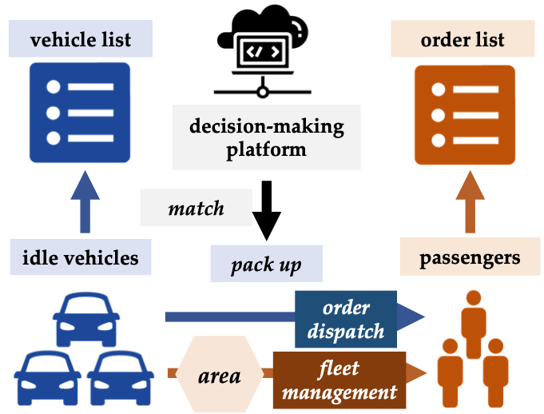

# CoRide
<p align="center">
  
  <br />
  <br />
</p>
This is the simulator serves as the training and evaluation platform in the following work:

> CoRide: Joint Order Dispatching and Fleet Management for Multi-Scale Ride-Hailing Platforms </br>
Jiarui Jin, Ming Zhou, Weinan Zhang, Minne Li, Zilong Guo, Zhiwei Qin, Yan Jiao, Xiaocheng Tang, Chenxi Wang, Jun Wang, Guobin Wu, Jieping Ye. </br>
[CIKM 2019 Oral](https://arxiv.org/pdf/1905.11353.pdf)

### Prerequisites
- Python 3


### Docs
This simulator is the joint order dispatching and fleet management based on [Previous Simulator](https://github.com/illidanlab/Simulator).
Please find more details of usage in [Wiki](https://github.com/illidanlab/Simulator/wiki).

### References
If you find this work helpful in your research, please consider citing the following paper. The bibtex are listed below:
```bibtex
@inproceedings{jin2019coride,
  title={Coride: joint order dispatching and fleet management for multi-scale ride-hailing platforms},
  author={Jin, Jiarui and Zhou, Ming and Zhang, Weinan and Li, Minne and Guo, Zilong and Qin, Zhiwei and Jiao, Yan and Tang, Xiaocheng and Wang, Chenxi and Wang, Jun and others},
  booktitle={Proceedings of the 28th ACM International Conference on Information and Knowledge Management},
  pages={1983--1992},
  year={2019}
}
```